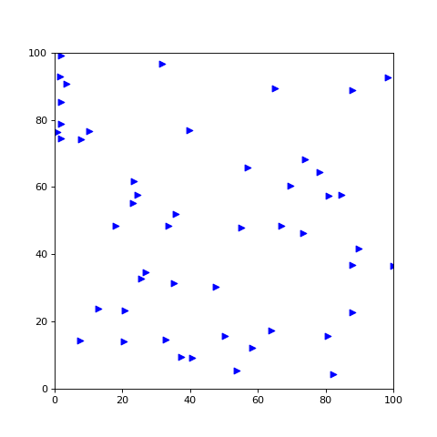

# Implementación y análisis de comportamientos emergentes

Aquí presento una implementación del algoritmo de Boids (Reynolds, 1987) para estudiar el comportamiento emergente.

## Resultados Visuales

Mira cómo las reglas locales simples generan un comportamiento de enjambre coherente:

